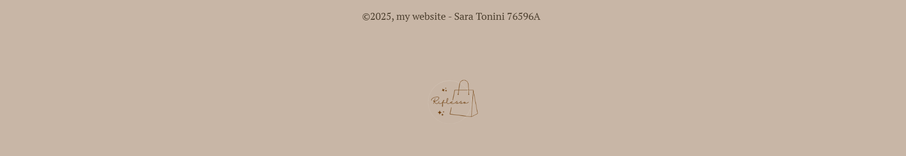

## Idea of the project
My goal in life is to work in fashion marketing, so I wanted to create a project that reflects that.  
For this reason, I chose the name **riflesso**.

This website is about an imaginary image consulting agency. Here you can book an appointment with the experts, but not just that, you can also find a section dedicated to advices and inspiration looks updated monthly.

---

## What I have used...

### HTML
To establish the website’s main structure with all the text and images.

---

## What I have used...
### CSS
- To create a different style for each section.
- To make the picture in the homepage round.

---

## What I have used...
### JavaScript
- Menu: show and hide the sidebar.
- In the page of advices, we can open and close all the sections that contain the outfit’s photo.

---

## Website structure

I created a website with four sections: homepage, book, information, and advices.

---

### Homepage ✨

- Header with title, logo, and a different background.
- Information “about us”.
- Explanation about what we offer to our clients.
- Our location with an interactive map.

---

---

---

---

---

### Book ✨

In this page, you can send us a message through e-mail where you can contact us to book an appointment.

---

### Informations ✨

Here you can send us a WhatsApp message where you can ask our team for any information about the service.

---

### Advices ✨

This is the section where you can find our advices and pictures of some outfit that girls can take inspiration from when they don't know what to wear!  
I divided it in different section based on the occasion.

---

# Thank you!

